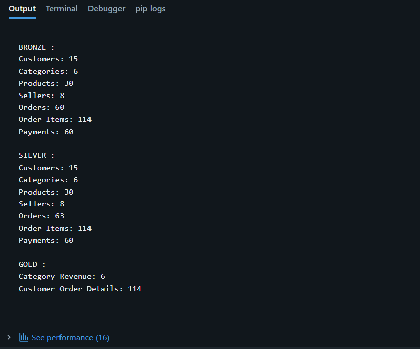
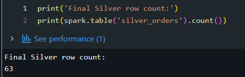
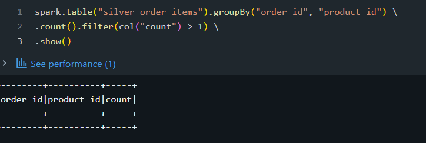
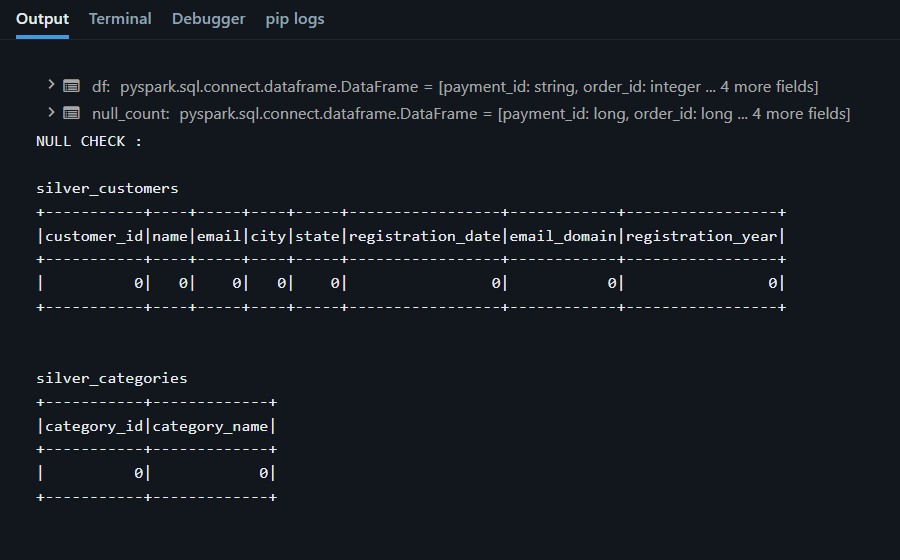
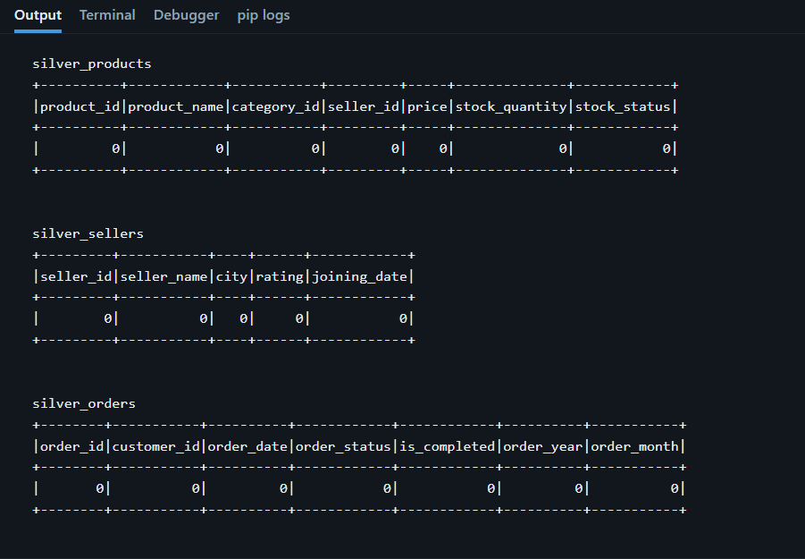
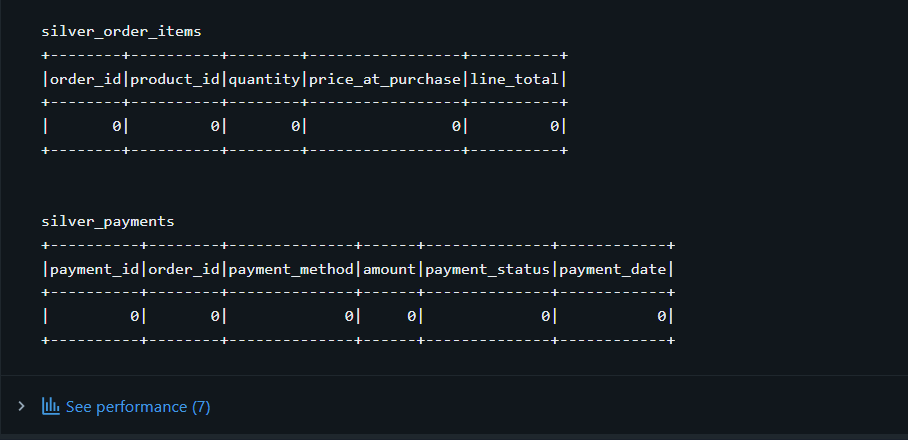

# E-Commerce Data Engineering Pipeline

This is an end-to-end data engineering project I built while learning PySpark and Databricks.

The main goal of this project was to take raw e-commerce CSV data, process it using a Bronze-Silver-Gold architecture, create useful analytics tables, and practice incremental data loading using Delta Lake.

## What I Used

- Python
- PySpark
- Databricks
- Delta Lake
- Spark SQL
- CSV
- GitHub

## Project Flow

```text
CSV Files
    |
    v
Bronze Layer
    |
    v
Silver Layer
    |
    v
Gold Layer
    |
    v
Incremental Processing
    |
    v
Delta MERGE
```

## Dataset

I used 7 CSV files:

- `customers.csv`
- `categories.csv`
- `products.csv`
- `sellers.csv`
- `orders.csv`
- `order_items.csv`
- `payments.csv`

These datasets represent a small e-commerce system with customers, products, sellers, orders and payments.

## Bronze Layer

In the Bronze layer, I loaded the raw CSV files into Delta tables.

Tables:

- `bronze_customers`
- `bronze_categories`
- `bronze_products`
- `bronze_sellers`
- `bronze_orders`
- `bronze_order_items`
- `bronze_payments`

### Bronze Result

| Dataset | Rows |
|---|---:|
| Customers | 15 |
| Categories | 6 |
| Products | 30 |
| Sellers | 8 |
| Orders | 60 |
| Order Items | 114 |
| Payments | 60 |

## Silver Layer

In the Silver layer I performed different transformations and added useful columns.

Some examples:

- Extracted email domain from customer email
- Added registration year
- Created stock status
- Created completed order flag
- Added order year and month
- Calculated line total
- Performed joins between related tables
- Checked for NULL values
- Checked for duplicate order/product combinations

Silver tables:

- `silver_customers`
- `silver_categories`
- `silver_products`
- `silver_sellers`
- `silver_orders`
- `silver_order_items`
- `silver_payments`

### Silver Result

| Dataset | Rows |
|---|---:|
| Customers | 15 |
| Categories | 6 |
| Products | 30 |
| Sellers | 8 |
| Orders | 63 |
| Order Items | 114 |
| Payments | 60 |

The order count becomes 63 because I added 3 new orders as part of the incremental processing practice.

## Gold Layer

The Gold layer contains the data that can be used for analysis.

I created:

### `gold_category_revenue`

Used to calculate revenue by category.

### `gold_customer_orders_details`

Contains customer and order details for analysis.

### Gold Result

| Table | Rows |
|---|---:|
| Category Revenue | 6 |
| Customer Order Details | 114 |

## Incremental Processing

One of the main things I wanted to practice in this project was incremental data loading.

The process I implemented was:

```text
Get latest order date
        |
        v
Get maximum existing order ID
        |
        v
Create new incoming orders
        |
        v
Add Silver columns
        |
        v
Delta MERGE
        |
        v
Update Silver table
```

For the MERGE I used:

```python
DeltaTable.forName()
merge()
whenMatchedUpdateAll()
whenNotMatchedInsertAll()
```

After the incremental load, the Silver orders count became 63.

## Data Quality Checks

I added NULL checks for the Silver tables.

The final checks showed **0 NULL values for the checked columns**.

I also checked for duplicate:

```text
order_id + product_id
```

combinations in `silver_order_items`.

The duplicate check returned no records.

## Final Result

```text
===== BRONZE =====
Customers: 15
Categories: 6
Products: 30
Sellers: 8
Orders: 60
Order Items: 114
Payments: 60

===== SILVER =====
Customers: 15
Categories: 6
Products: 30
Sellers: 8
Orders: 63
Order Items: 114
Payments: 60

===== GOLD =====
Category Revenue: 6
Customer Order Details: 114
```

## Validation Screenshots

### Final Pipeline Results



### Incremental Processing



### Duplicate Check



### NULL Check







## Things I Practiced in This Project

### PySpark

- DataFrames
- `select()`
- `filter()`
- `withColumn()`
- `when()` and `otherwise()`
- `join()`
- `groupBy()`
- Aggregate functions
- Date functions
- Window functions
- `rank()`
- `lag()`
- `collect()`
- `monotonically_increasing_id()`

### Databricks / Delta Lake

- Databricks Volumes
- Delta tables
- Bronze-Silver-Gold architecture
- Incremental data processing
- Delta MERGE
- Data quality checks

## Project Structure

```text
Ecommerce_Pipeline/
|
|-- ecommerce_data_engineering_pipeline.py
|-- README.md
|
`-- screenshots/
    |-- final_pipeline_results.png
    |-- incremental_processing.png
    |-- duplicate_check.png
    |-- null_check_1.png
    |-- null_check_2.png
    `-- null_check_3.png
```

## How to Run

1. Open the Python notebook in Databricks.
2. Make sure the required compute is attached.
3. Make sure the 7 CSV files are available in the Databricks Volume.
4. Run the notebook from the first cell.
5. Check the Bronze, Silver and Gold results at the end.
6. Check the NULL and duplicate validation results.

## Future Improvements

Some things I would like to add later:

- Airflow for orchestration
- Databricks Workflows
- Automated data quality checks
- PySpark unit testing
- Power BI dashboard
- CI/CD using GitHub Actions
- Cloud storage such as Azure Data Lake or AWS S3

## Author

**Gaurav Saini**

B.Tech ECE | Aspiring Data Engineer
